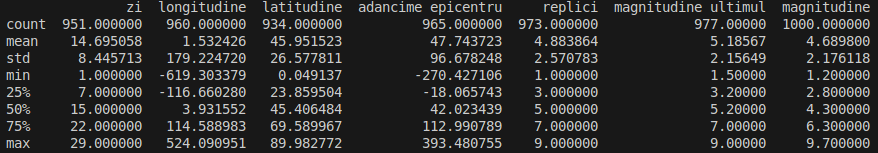
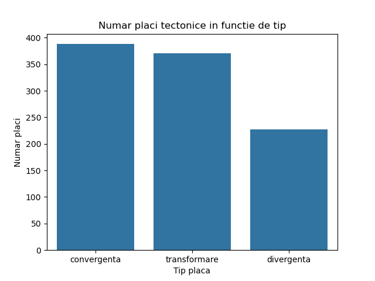
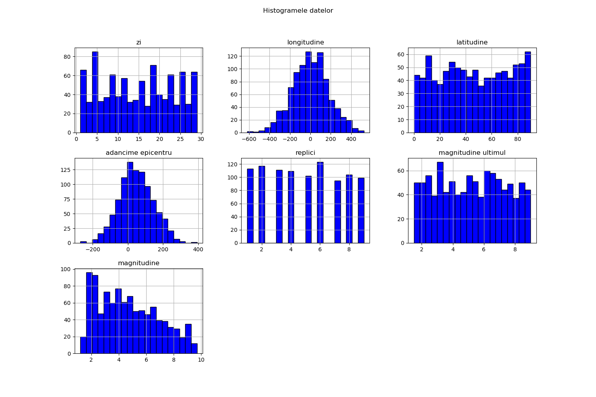
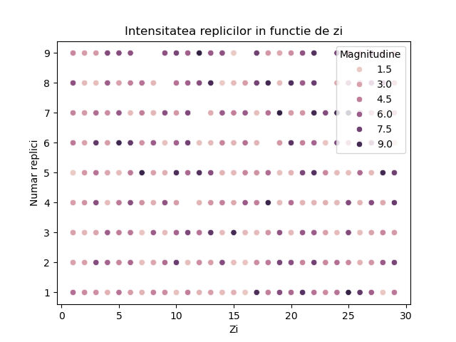
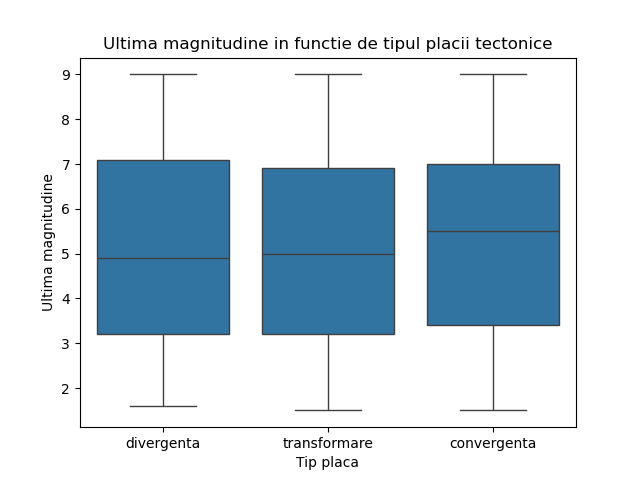
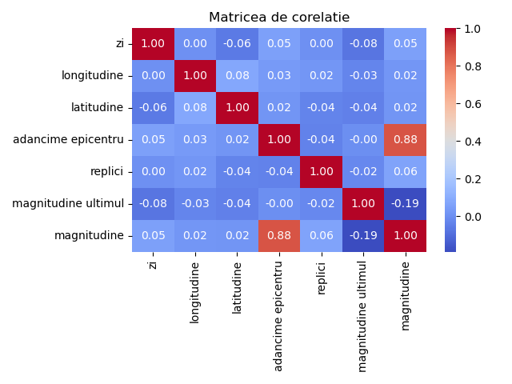
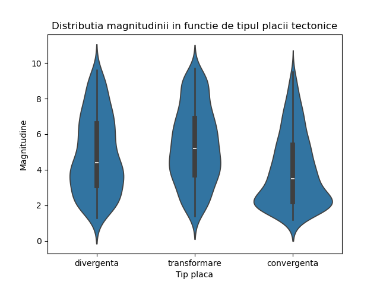
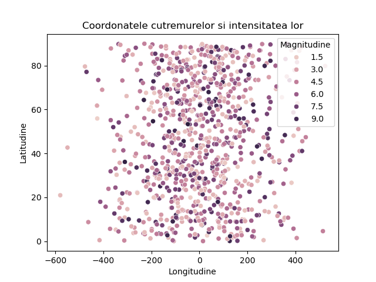
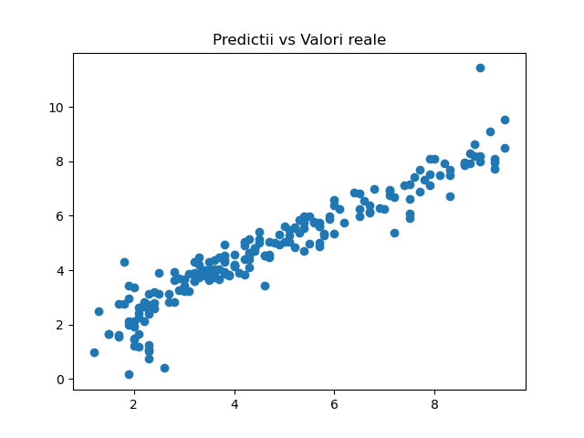

#### Nume: Ivan Andrei-Cristian, Grupa: 311CAa

# Proiect PCLP3 - Analiza cutremurelor

Pentru testare și simulare, apelați programul cu `python3 main.py`.

Problema aleasă presupune plecarea de la un dataset care conține informații relevante pentru predicția magnitudinii unor cutremure. Astfel, problema aleasă este o problemă de **regresie**.

Setul de date va conține $1 \ 000$ linii și va fi împărțit aleator între _test_ și _train_. Subset de antrenare va avea $800$ de instanțe, iar cel de testare va avea $200$ de instanțe.

Setul de date va conține $8$ coloane, fiecare coloană având tipurile de date următoare:

* zi: `int64`
* longitudine: `float64`
* latitudine: `float64`
* adancime epicentru: `float64`
* tip placa: `object`
* replici: `int64`
* magnitudine ultimul: `float64`
* magnitudine: `float64`

Setul de date va fi generat aleator. Datele vor fi generate folosind distribuția normală și uniformă, presupunând următoarele ipoteze:

* Zilele vor reprezenta zilele unei luni, deci vor fi cuprinse între $0$ și $30$.
* Latitudinea va fi curpinsă între $0$ și $90$, iar longitudinea între $0$ și $180$.
* Adâncimea epicentrului va fi cuprinsă între $50$ și $100$ km.
* Plăcile pot fi: **divergente, convergente** sau **de transformare**.
* Ultime magnitudini vor fi cuprinse între $1.5$ și $9$.
* Magnitudinile vor fi calculate conform formulei: $2 \ +$ un număr random între $0$ și $3$ în funcție de tipul plăcii $- \ 0.2 \times ($ magnitudine ultimul $- \  2) \ + \ 0.1 \times$ replici $+ \ 0.025 \times $ adâncime. Ne asigurăm la final că magnitudinea este cuprinsă între $2$ și $9$.

La final, vom alege un procent aleator între $0\%$ și $10\%$ de valori din fiecare coloană pentru a le elimina.

## EDA

### Analiza valorilor lipsă

* Pe coloana zi lipsesc $49$ linii ($4.9\%$)
* Pe coloana longitudine lipsesc $40$ linii ($4\%$)
* Pe coloana latitudine lipsesc $66$ linii ($6.6\%$)
* Pe coloana adancime epicentru lipsesc $35$ linii ($3.5\%$)
* Pe coloana tip placa lipsesc $14$ linii ($1.4\%$)
* Pe coloana replici lipsesc $27$ linii ($2.7\%$)
* Pe coloana  magnitudine ultimul lipsesc $23$ linii ($2.3\%$)

### Statistici descriptive

Utilizând funcția `df.describe()`, obținem următoarele detalii:

### Analiza distribuției variabilelor

### Analiza corelațiilor

### Analiza relațiilor cu variabila țintă

## Antrenarea și evaluarea unui model de bază

Fiindcă abordăm o problemă de regresie, vom folosi, din biblioteca `scikit-learn`, modelul de **regresie liniară**. Folosind metrica **RMSE**, obținem o eroare de $0.49$.

